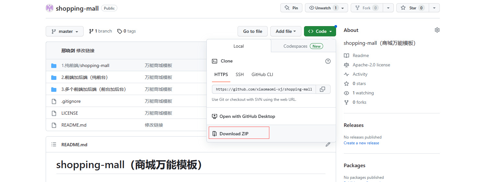

# 项目下载及使用

## 项目的下载
> **版本：**`最终版`
- **[项目地址(gitee)](https://gitee.com/xiaomaomi-xj/shopping-mall)**
- **[项目地址(github)](https://github.com/xiaomaomi-xj/shopping-mall)**

- **1.点击`克隆/下载`,点击下载ZIP**

- **2.下载好把他解压出来`(使用纯前端的看到这里即可)`**

- **3.解压好后，进入，双击`2.前端加后端`**

- **4.进去之后双击`后端`**

- **5.进去之后，右击`shopping-mall`，选择`open Folder...`**

- **6.之后等待下方的进度条走完，可能会耗时间，可以先玩一会，等他走完就好了**

## java的安装
> **版本：**`11`
- **1.等到进度条走完后，打开项目，双击`ShoppingMallApplication`打开,然后点击`configure`,点击`Download jdk`**

- **2.选择`amazon corretto`，选择版本`11.0.9`，点击`download`**

- **3.等待下方进度条下载完成**

- **4.下载完成之后，点击右侧的`maven`,然后点击那个旋转的小按钮**

- **5.等待下方进度条走完，就大功告成了**

## maven的安装
> **版本：**`3.6.3`
- **无需单独安装，IntelliJ IDEA自带**