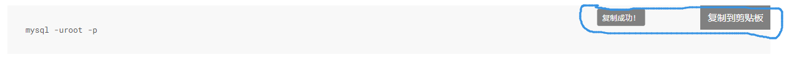
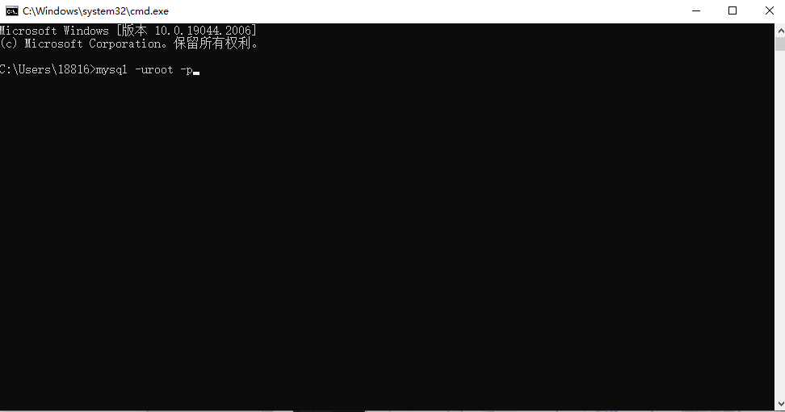

# 安装环境前必看

## 命令的执行
##### 每当我说到`cmd执行下面的命令`代表的意思就是：
- 1.**首先复制那个命令，例如：**

- 2.**键盘`win+r`键，输入cmd**

- 3.**然后回车或者点击确定会出来一个黑框**

- 4.**然后右击就可以粘贴，然后回车就可以执行**

## 安装软件的问题
[安装软件地址](/docs/dev-environment.md)
> **如果只使用纯前端，那么你就不需要安装太多的软件，只需要安装一个`nodejs`和`vscode`就好了**

> **如果你使用了前端加后端，或者前台加后台，那么就需要把软件全部安装**

> **为了给各位省气力，我会把安装软件的详细过程都展示出来，并且我把一些软件安装都交付给了强大的`IntelliJ IDEA`例如（`maven`,`java11`）,这样安装软件浪费的时间就可以减少**

> **当然下载项目不论是从gitee还是github拥有`git`软件是方便的，但是我如果让各位安装的软件太多的话，各位肯定会生气，所以我就抱着能不多安软件就不多安装，最后只要能正常跑起来项目就行了**

## 对于软件的版本问题
> **除了mysql以外，其他软件的版本都不会对项目有影响，所以不要看到我下载哪个版本你就非要下载那个版本**

> **虽然对mysql版本有所要求，但是版本不一样，也不需要再重新安装，后面我会说到这个问题，就算版本不一样也没事的**

## 对于外国的软件下载慢的问题

- **对于这个问题，因为软件官网在外国，而我们又有可爱的墙，所以会导致下载很慢，不过不用担心，一共下载慢的软件有两个(`vscode`,`redis`)，我都提前下载好了，到时候你们用我给的下载链接就好了**

- **这两个软件都来源于官网，并且保证`没有篡改`过，请放心使用**