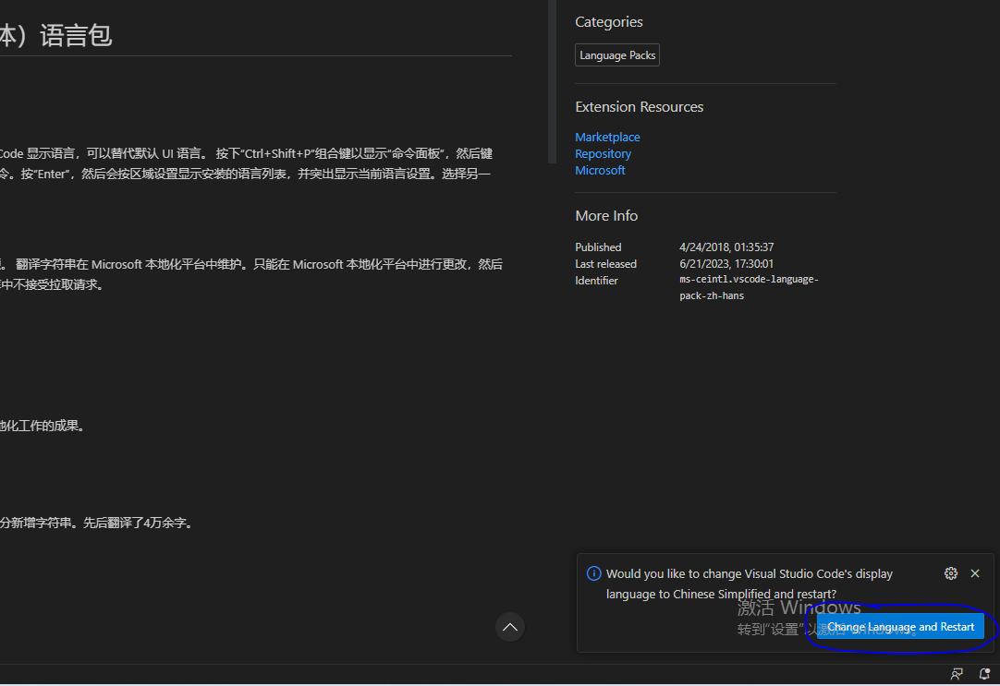
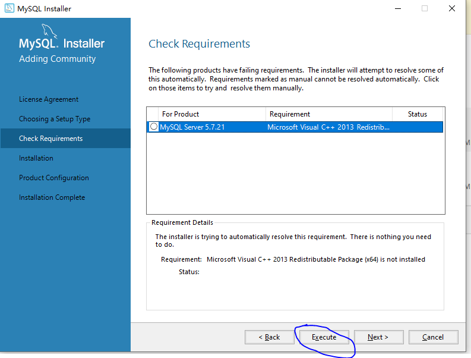
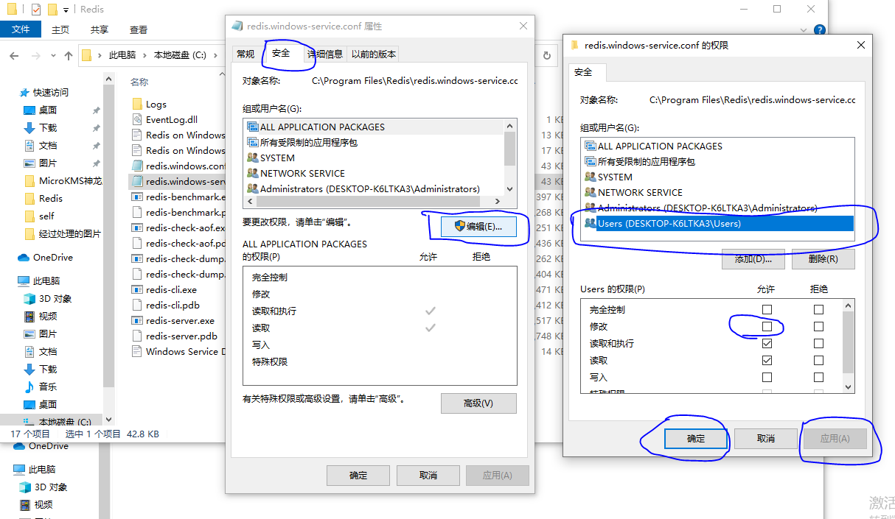
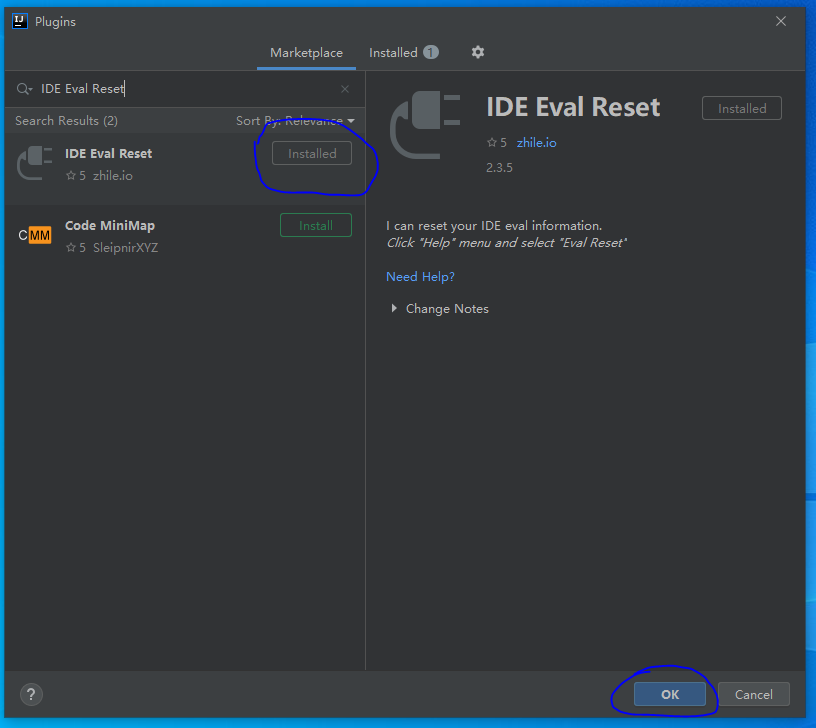

# 软件环境安装

## nodejs的安装
> **版本：**`18.16.1`
### nodejs的下载
- **[下载地址](https://nodejs.org/en)**

- **下载左侧的稳定版即可**


### nodejs的安装
- **1.一直next，直到安装完毕！**

- **2.安装完成后，cmd执行下面的命令，查看版本号,像下面这样就代表安装成功**
```shell
node -v
```


- **安装好之后，可以配置一下淘宝镜像，提升下载速度,cmd执行下面的命令**
```shell
npm config set registry https://registry.npm.taobao.org
```


- **也可再安装一下ts，为了后台前端二次开发，这个安不安装都是无所谓的，cmd执行下面的命令**
```shell
npm install -g typescript
```


## vscode的安装
### vscode的下载
- **[下载地址（因为官网很慢，我就先为你们下好了，这样你们下载的时候就快了）](https://xiaomaomi-xj.github.io/shopping-mall-help/source/dev-environment/vscode/VSCodeUserSetup-x64-1.79.2.exe)**

### vscode的安装

- **1.vscode安装过程比较简单，除了下面这个页面，勾选一下，其他的一直下一步即可**


- **2.接下来我们安两个插件，一个是把软件变成英文的，搜`chinese`,然后install安装**


- **3.安装好后，会有个弹窗，需要重启软件，点击即可**



- **4.还需要安装一个启动服务的插件，搜`live server`,点击安装**


## mysql的安装
> **版本：**`5.7.21`
### mysql的下载
- **[下载地址](https://downloads.mysql.com/archives/installer/)**

- **选择5.7.21版本，别的版本可能会有明文密码安全问题，`如果你用的是别的版本`，也不需要重新安装，后面我会解决这个问题。**


- **选择第二个进行下载**


### mysql安装教程：

- **1.下载好软件我们就直接打开,勾选我同意...，然后点击next**


- **2.选择第二个，点击next**


- **3.因为我用的一个全新的系统什么都没有，所以需要安装一下`vc++ 2013`，如果你们没有这个页面不用管，如果有的话，选中点击execute**



- **4.点击之后就会弹出这个页面，还是一样勾选我同意...，然后点击install,安装完之后点击next**


- **5.点击execute**


- **6.打对号后，点击next**


- **7.next**


- **8.选中第一个，next**


- **9.和我勾选的一样就行（默认就是如此），next**


- **10.设置一个你的root账号的密码，防止遗忘建议设置`123456`,后面还可以修改**

- ****

- **11.和我勾选的一样就行，next**


- **12.和我勾选的一样就行，点next**


- **13.点击execute，等待所有的都打绿勾**


- **14.然后点击finish**


- **15.点击next**


- **16.finish**


- **16.1.额外的一步（cmd执行下面的命令）**
```shell
mysql -uroot -p
```
- **如果你的是这样的，那么后面的几个mysql的步骤就不用看了**


- **如果你的是这样的，那么请继续往下看**


- **17.`win+q`输入`服务`，回车**


- **18.找到MYSQL57,`双击`**


- **19.先看启动按钮是否可以点击，如果可以点击，就手动点击，如果不可以点击，就代表他正在运行中，就不用点击了**


- **20.复制一下这个路径**


- **21.`win+e`右击此电脑，点击属性**


- **22.点击高级系统管理**


- **23.点击环境变量**


- **24.选中Path，点击编辑**


- **25.点击新建**


- **26.把刚刚复制的路径粘贴上去,然后-确定-确定-确定**


- **27.然后`重新打开`一个cmd执行下面的命令，回车输入你的密码，出现和我一样的效果就成功了安装了mysql**
```shell
mysql -uroot -p
```


- **28.如果你的还是这种情况，请从17步从新开始，主要看第20步，最左边不要复制`"`,最右边不要复制`\`**


## redis的安装
> **版本：**`3.0.504`
### redis的下载
- **[下载地址（因为github很慢，我就先为你们下好了，这样你们下载的时候就快了）](https://xiaomaomi-xj.github.io/shopping-mall-help/source/dev-environment/redis/Redis-x64-3.0.504.msi)**

### redis安装教程
- **1.redis安装非常简单，除了以下这个页面需要勾选一下，其他的都选择下一步即可**


- **2.安装完成后，还是`win+q`，输入服务，找到Redis，双击，查看启动按钮，是否可以点击，如果可以点击就手动点击，不可以点击就不需要管,然后复制一下他的路径**


- **3.`win+e`打开资源管理器，把刚刚复制的路径打开**


- **4.找到`redis.windows-service.conf`这个文件**


- **5.打开这个文件，这里选择记事本打开**


- **6.`ctrl+f`搜索`requirepass`,找到这一行,这一行代表的是redis的密码**


- **7.把这一行前面的`#`去掉，把后面的改成你想要的密码,我这里改的是`123456`，然后对文件进行保存**


- **8.如果你也和我一样，把文件放在了`C盘`，那么保存可能没有权限**


- **9.解决办法是,右击这个文件，选择`属性`，选择`安全`，点击`编辑`，选择`Users...`，然后把`修改`勾选上，然后点击`应用`，`确定`->`确定`,这时候就有权限，再从第5步开始就好了**





## IntelliJ IDEA的安装
> **版本：**`2022.2`
### IntelliJ IDEA的下载
- **[下载链接](https://download.jetbrains.com/idea/ideaIU-2020.2.2.exe)**
- **[其他版本下载地址](https://www.jetbrains.com/zh-cn/idea/download/other.html)**

### IntelliJ IDEA安装以及破解
- **1.IntelliJ IDEA的安装也很简单，基本上都是默认的就好，只有在下面的这些页面进行勾选一下**


- **2.这个勾选第二个，意思就是先别重启电脑**


- **3.安装好后去桌面打开此软件，勾选我同意...，点击continue**


- **4.点击dont send**


- **5.点击skip ....**


- **6.先点击`evaluate for free`,再点击`evaluate`**


#### 破解方法1

- **7.开始破解，点击`configure`下拉框，点击`plugins`**


- **8.点击那个小设置图标，选择第一个`maven ....`**


- **9.点击`+`，把下面的内容复制进去**
```
https://plugins.zhile.io
```


- **10.在输入框搜索`IDE Eval Reset`回车，然后点击`install`进行安装**
```
IDE Eval Reset
```


- **11.点击accept**


- **12.安装插件完成后会显示`installed`，点击ok**



- **13.点击`get help`下拉框，选择`eval reset`**


- **14.勾选`auto reset before per restart`,点击`reset`，等待IntelliJ IDEA重启就破解成功了**


- **然后就先可以把软件关掉**

#### 破解方法2
- **如果你无法通过上面的方法进行下载插件，可以使用参考[无限重置事件破解](https://zhile.io/2020/11/18/jetbrains-eval-reset-deprecated.html)**

#### 破解方法3
- **由于上面的破解方式仅支持老版本IntelliJ IDEA，如果你想用新版本的，请参考[下载激活工具破解](https://tech.souyunku.com/?p=30970)**