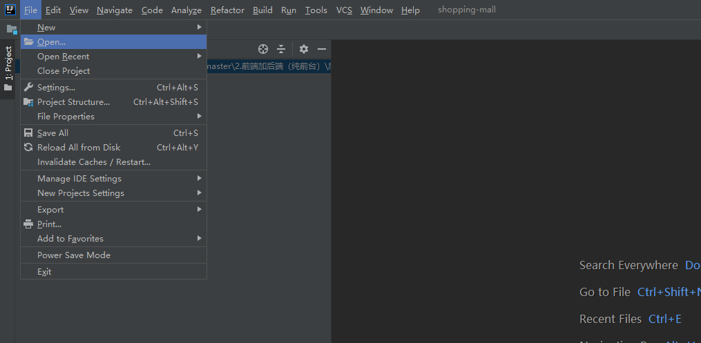
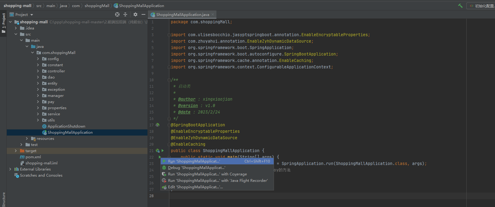
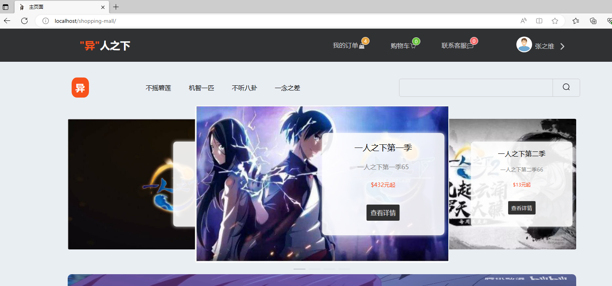

# 前台加后台项目

> 看这个之前必须先看[带后端的公共部分必看](/docs/public-end.md)

## 增加管理员账号
- **首先增加一个管理员账号，增加管理员账号文件路径：`shopping-mall\src\test\java\com\shoppingMall\增加管理员账号.java`**


- **运行**


- **看到`Process finished with exit code 0`,运行成功，则我们就拥有一个管理员账号，登录后台使用的**


## 运行后端

- **1.IntelliJ IDEA打开,选择`open...`**



- **2.找到`多个前端加后端->总后端->shopping-mall`,点击ok**


- **3.找到启动文件，路径：`shopping-mall\src\main\java\com\shoppingMall\ShoppingMallApplication.java`，然后启动**



- **4.启动成功的样子**


## 运行前台前端

- **1.vscode打开，选择`打开文件夹`**


- **2.找到`多个前端加后端->前台前端->shopping-mall`,点击选择文件夹**


- **3.然后打开终端**


- **4.然后输入以下内容：**
```shell
npm install
```


- **5.下载完之后，输入以下内容：**
```shell
 npm run serve
```


- **6.然后就可以看到两个链接**


- **7.选第一个，浏览器打开**



## 运行后台前端

- **1.再打开一个vscode，（桌面再双击vscode的图标）**


- **2.选择`打开文件夹`**


- **3.找到`多个前端加后端->后台前端->shopping-mall`,点击选择文件夹**


- **4.找到`index.html`文件，打开它**


- **5.在文件内容里面，`右击`->`open with live server`**


- **6.点击会自动打开浏览器，账号和密码就是管理员账号和密码**


- **7.有了后台，我们就可以为所欲为了，就像之前的购物卡账号问题，轻松解决**

