# 前端加后端项目

> 看这个之前必须先看[带后端的公共部分必看](/docs/public-end.md)

## 运行后端

- **1.IntelliJ IDEA打开,选择`open...`**

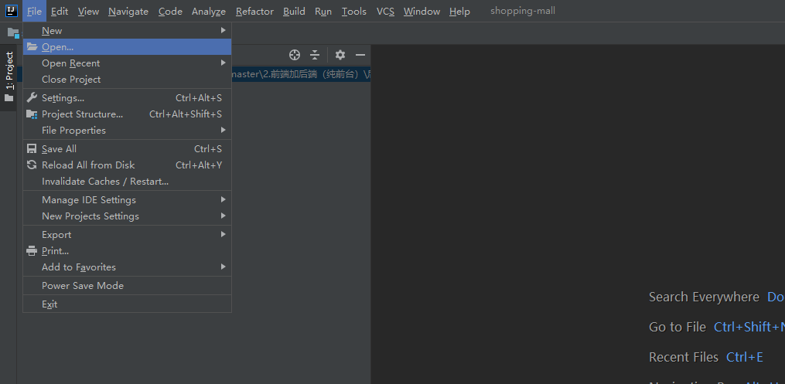

- **2.找到`前端加后端->后端->shopping-mall`,点击ok**

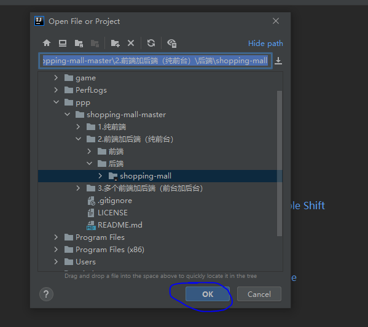

- **3.找到启动文件，路径：`shopping-mall\src\main\java\com\shoppingMall\ShoppingMallApplication.java`，然后启动**

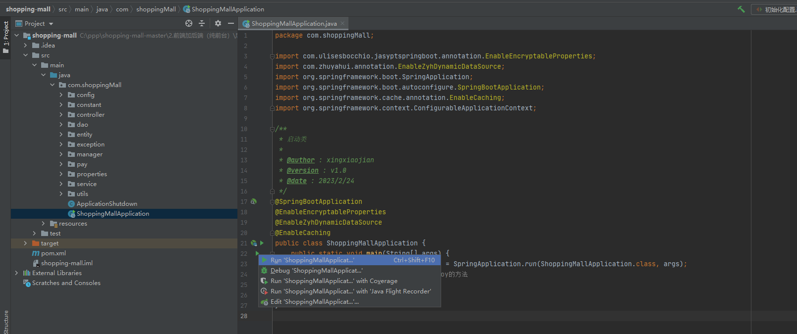

- **4.启动成功的样子**

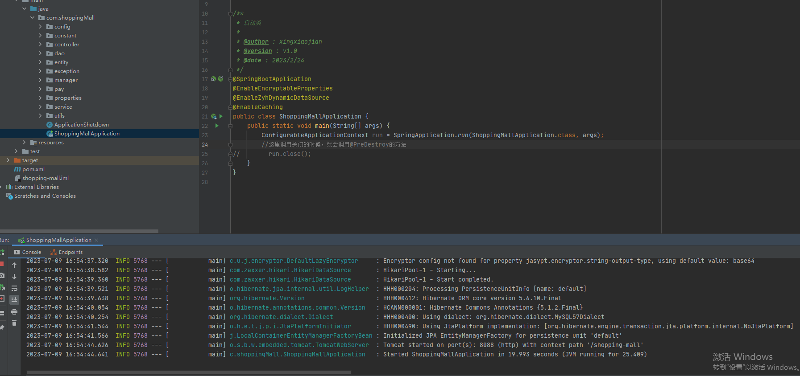

## 运行前端

- **1.vscode打开，选择`打开文件夹`**

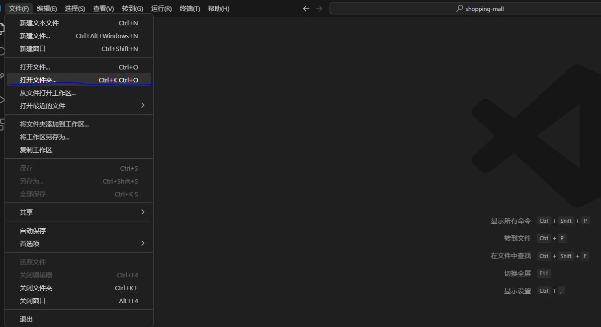

- **2.找到`前端加后端->前端->shopping-mall`,点击选择文件夹**

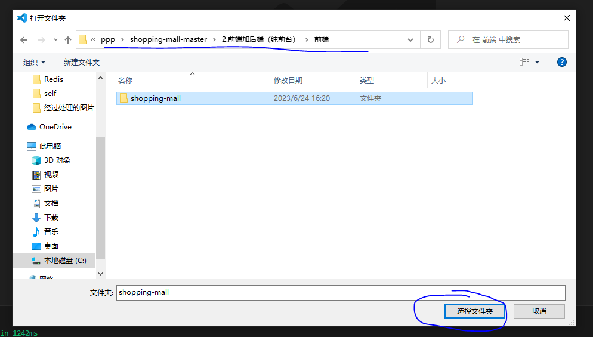

- **3.然后打开终端**

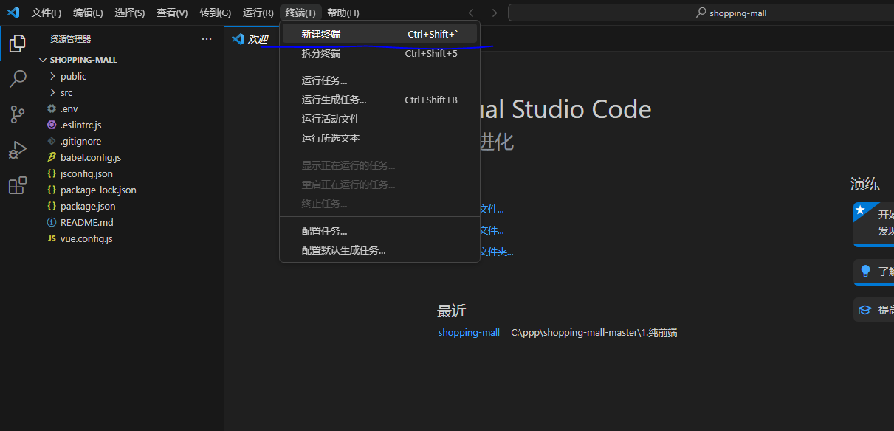

- **4.然后输入以下内容：**
```shell
npm install
```

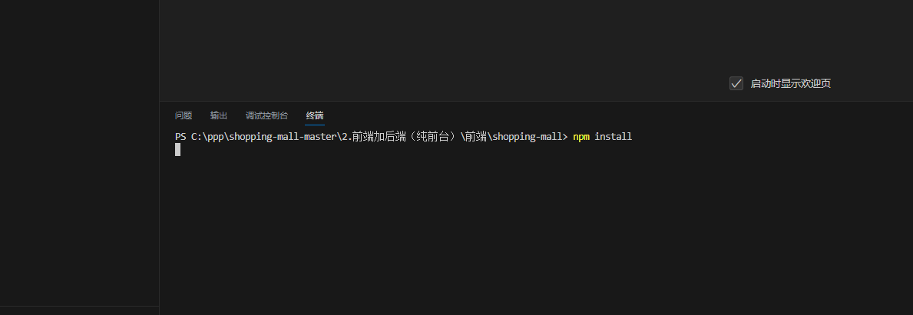

- **5.下载完之后，输入以下内容：**
```shell
 npm run serve
```

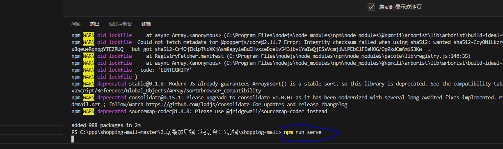

- **6.然后就可以看到两个链接**

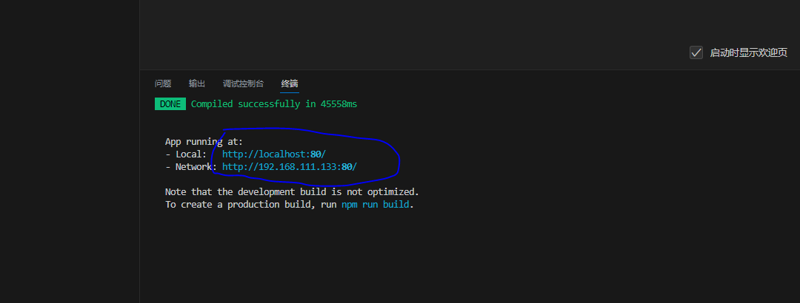


- **7.选第一个，浏览器打开**

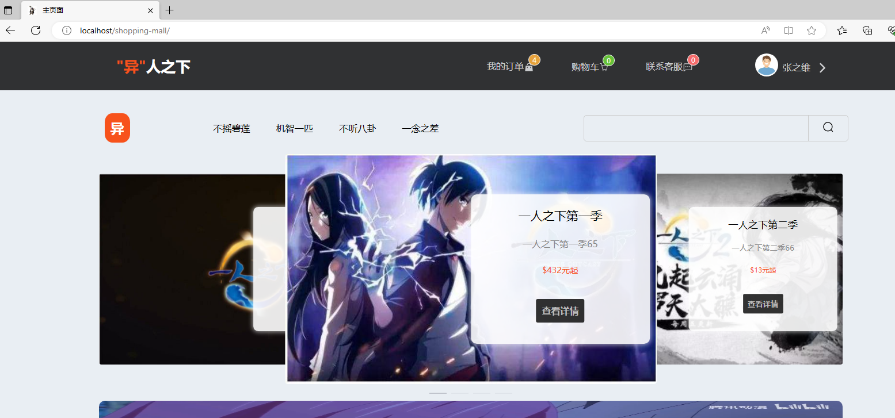

## 购物卡支付账号

> 因为这是前端加后端，所以是没有后台的，对于购物卡账号只能在数据库里面看

- **1.过程走一遍，首先我们点击`立即购买`，选择`购物卡支付`**

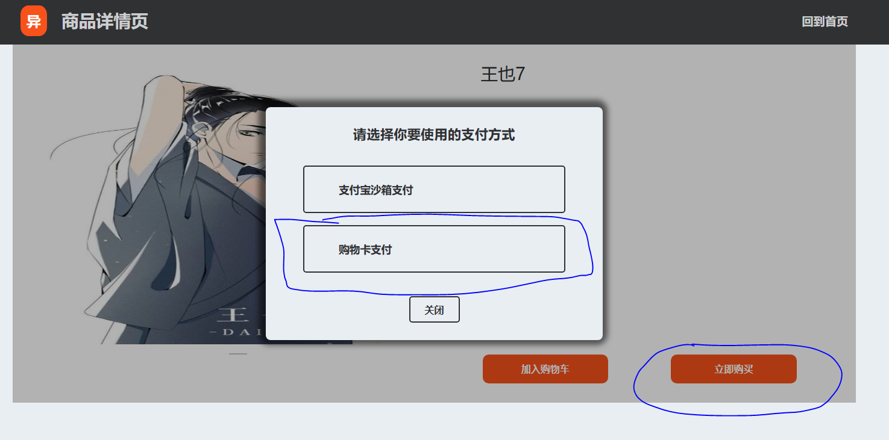

- **2.我们可以看到，支付需要购物卡卡号**
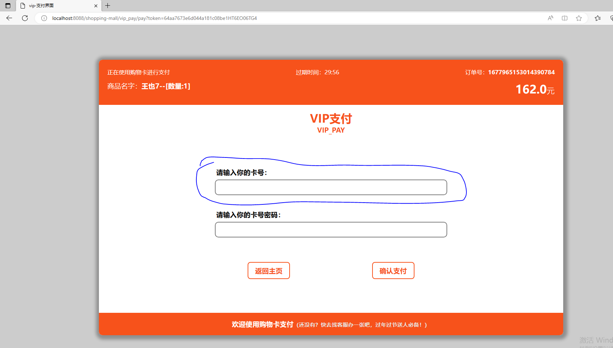

- **3.首先cmd执行下面命令：**
```shell
mysql -u root -p
```
- **3.1回车输入密码，然后再输入下面内容：**
```sql
use shopping-mall;
```
- **3.2回车再输入下面内容：**
```sql
select vip_card_account,vip_card_balance from vip_card;
```
- **3.3就可以看到账号和余额了，账号密码在`初始化配置->第三步有讲`，如果没改就是`123456`**
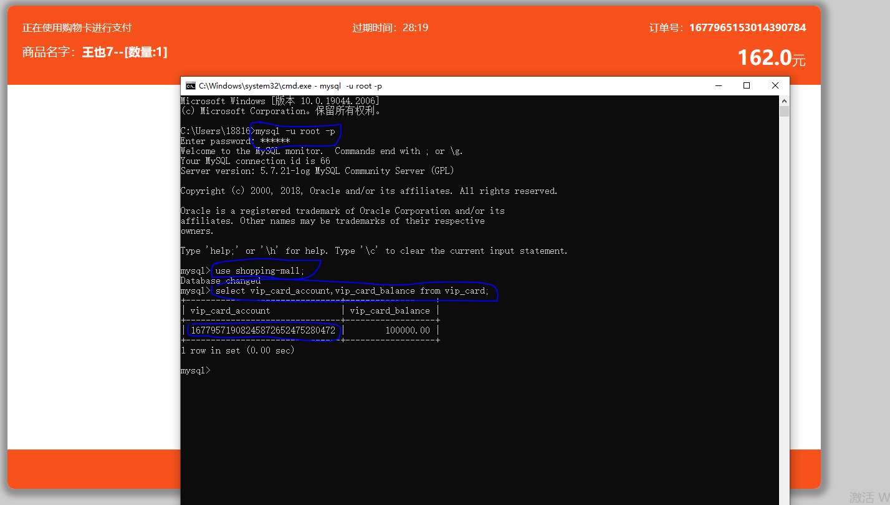

- **4.知道了这些就欧克了，其他功能自己摸索哦！**