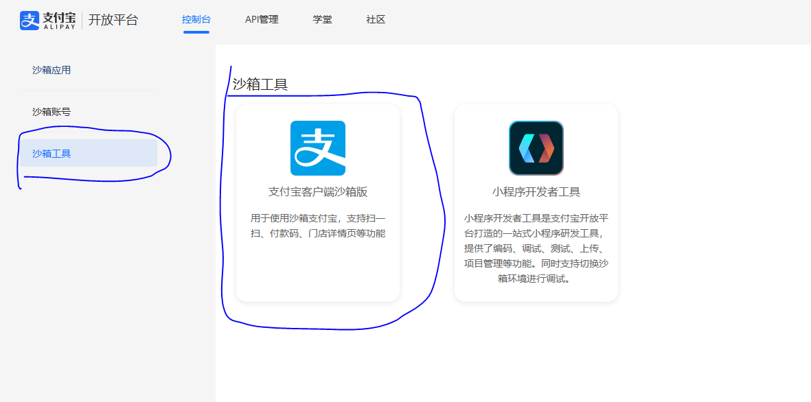
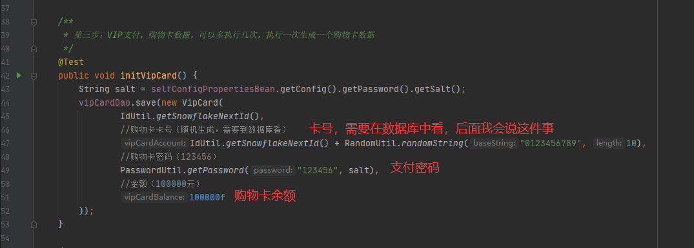

# 带后端的公共部分必看

> 前端加后端和前台加后台这两个项目的共同之处，如果你只是用纯前端，这里就不需要看了

## 配置文件所在目录
- **配置文件所在路径：`shopping-mall\src\main\resources\config`**


- **图片文件所在路径：`shopping-mall\src\main\resources\static`**


- **`img`下面还是之前的图片**


##### 除此之外还有一些特殊的图片
- **1.`check_error.png`:当`验证码过期`的时候，就会显示此图片**


- **2.`error.png`:当别的网站想要直接挂载咱网站的图片时，并不会显示真正的图片，而是会显示这一张图片，`也就是：防盗链`**


- **3.`qr_error.png`：这个是启用二维码登录的时候，二维码过期就会显示此图片**


## 邮箱配置
- **官方网址：[163邮箱](https://mail.163.com/)**

- **1.登录进去，打开`设置->pop3/smtp/imap`**


- **2.点击`新增授权密码`**


- **3.登录账号手机扫码，发送后，点击`我已发送`**


- **4.然后就可以看到授权码，一定要复制下来，先保存起来，只会显示一次**


## 微信测试公众号配置

> 因为我们是个人开发者，所以微信扫码登录，我们需要借助微信测试公众号

- **官方网址：[微信测试公众号](https://mp.weixin.qq.com/debug/cgi-bin/sandbox?t=sandbox/login)**

- **1.登录后，首先我们可以看到`appid`和`appsecret`**


- **2.往下翻可以看到，公众号二维码，你希望用那个微信进行扫码登录，就用那个微信关注一下这个测试公众号**


- **3.往下翻找到`网页账号`，点击修改**


- **4.之后就是，你用登录微信的手机开一个热点，电脑连接一下，然后cmd执行下面的命令**
```shell
ipconfig
```


- **然后复制一下这个ip地址，后面加上`:8088`，粘贴上去**


## 支付宝沙箱支付配置

> 因为我们是个人开发者，所以需要沙箱环境，沙箱环境本来就是给做开发测试用的

- **官方网址：[支付宝开放平台](https://auth.alipay.com/login/ant_sso_index.htm?goto=https%3A%2F%2Fopen.alipay.com%2Fdevelop%2Fsandbox%2Fapp%3Fis_switch_sandbox%3Dtrue)**

- **1.登录后，可以看到一些基本信息，支付回调地址内容如下，点击修改`填上`：**
```
http://localhost:8088/shopping-mall/alipay/callback
```


- **2.接口加密方式选择`系统默认密匙`,点击`查看`**


- **3.我们只需要`应用公钥`和`支付宝公钥`**


- **4.加密方式，点击`查看`**


- **5.加密密码**


- **6.因为是沙箱环境，肯定不能支付真的钱，所以阿里提供了一个专门的测试软件，和支付宝软件类似，请使用手机下载安装**



- **7.登录账号也是要用阿里提供的测试账号，`em...,可能一辈子也见不到那么多钱`**


## 初始化配置

> 前端加后端和前台加后台都拥有初始化配置

- **初始化配置文件路径：`shopping-mall\src\test\java\com\shoppingMall\初始化配置.java`**


- **把需要填的东西填上，所有内容上面都有（`邮箱配置`，`微信测试公众号`，`支付宝沙箱支付`）,这个地方的商城名字用于发送邮箱证码、启动等等时候用，所以建议和`页面上的特殊配置.json`里面的商城名字保持一致**


##### 开始执行

> 所有注意点，都在注释上写的很清楚，这个初始化配置文件只需要执行一次就好，之后再启动项目，就不需要再执行这个初始化配置文件了

- **1.首先执行第一步**


- **2.执行完后的样子**


- **3.可以查看是否执行成功了,cmd执行下面命令**
```shell
mysql -u root -p
```
- **3.1输入密码，然后回车，执行下面的命令，看看是否含有`shopping-mall`**
```shell
show databases;
```


- **4.（如果你有`shopping-mall`不需要看这一步）如果你使用的`别的版本的mysql`可能没有`shopping-mall`，需要按下面这种方式执行，回车输入密码回车,(这样就解决了)**


- **5.开始第二步之前，先把沙箱支付宝需要的参数填一下**


- **6.开始执行第二步**


- **7.执行完，会看到`Process finished with exit code 0`**


- **8.执行第三步前介绍一下各个参数**



- **9.开始执行第三步**


- **10.执行完，会看到`Process finished with exit code 0`**


- **11.开始执行最后一步**


- **12.执行完，会看到`Process finished with exit code 0`**


## 特殊说明（重要）
- **初始化配置`执行一次就够了`，以后再启动项目，只需要启动文件就好了**


##### 但是因为扫码登录需要热点，可能导致今天的ip是这个，明天的ip就换了，对于这种情况，解决方法
- **1.你用登录微信的手机开一个热点，电脑连接一下，然后cmd执行下面的命令**
```shell
ipconfig
```


- **2.再打开[微信测试公众号](https://mp.weixin.qq.com/debug/cgi-bin/sandbox?t=sandbox/login)，找到`网页账号`，点击修改**


- **3.再把新的ip写上加上`:8088`**


- **4.找到配置文件，路径：`shopping-mall\src\main\resources\application.yml`，找到`redirect_url`**


- **4.还要把新的ip写到配置文件**


- **5.然后启动项目即可，如果你之前先启动了，后来发现ip变了，改了之后，只需要重新启动就好了**


##### 图片缓存的问题
- **在某些情况下，例如修改了`shopping-mall\src\main\resources\static\img`下面的图片，名字没变，就是图片换了，但是浏览器还是显示之前的图片，刷新也没用，重启项目也没用，这就是浏览器的缓存，需要清除一下浏览器缓存**

- **以`Microsoft Edge`览器为例（其他浏览器怎么清理缓存，自行百度，都大同小异）,先进到设置里面，搜索`缓存`**


- **选择`所有时间`，点击`立即清除`**


##### 商品价格问题
- **前端对于浮点数的问题，我没有处理，所以在为商品制定价格的时候，价格要是整数，别弄个`1.1、1.11`之类的，最好都是不带小数点的，例如`1、11、111`**