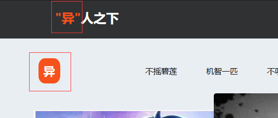

# 公共部分必看

## 自定义的配置文件
> 纯前端也好，前端加后端也好，前台加后台也好，都有这些文件
- **以纯前端举例，来讲讲这些配置文件**

## customImg
- **这是个文件夹，这个文件夹里面存放的是商品和界面的一些图片资源**

## 全部的商品数据.json
- **1.此json文件，配置着商品的信息**

- **2.imgUrl代表了商品的封面，所对应的值为图片的名字，需要把图片放到`customImg`下面**

- **3.goodsName代表了商品的名字**

- **4.goodsDescribe代表了商品的描述信息**
- **5.goodsPrice代表了商品的价格**
- **6.maxBuyNum代表了商品的库存数量**

- **7.rotationGoodsImgs代表了商品的其他介绍图片,需要把图片放到`customImg`下面**

### 修改商品
- **1.知道了上面那些，修改商品就太简单了，首先去找图片，然后把图片放到`customImg`里面**

- **2.然后把商品信息改成自己想要的**

- **3.此时页面就会发生变化**

- **4.这样就做到了随意修改商品的目的**

## 页面上的数据配置.json
### `toggleViewData`

- **1.titleName代表了标题的名字**
- **2.goodsDatas代表了有哪些商品`1，2，3，4，5，6`分别代表了不同商品，在文件`全部的商品数据.json`第一个商品就是1，第二个商品就是2，以此类推**

#### 那么知道这些，我们就可以很轻松的去控制了
- **1.我们来增加一个**

- **2.效果如下，是不是很简单**

### `rotationChartData`

- **其代表的是轮播图，goodsDatas里面的数字和上面的道理一样，就不啰嗦了**

### `goodsAdData`

- **此代表了广告数据，一共有两处，goodsDatas里面的数字和上面的道理一样，就不啰嗦了**

### `containerModuleData`

- **此代表了主要界面的内容，其所代表的含义看下图,像`specialGoodsInfo`等里面的数字代表的意思和goodsDatas一样**

### `orderData`

- **此代表的订单数据，购买商品生成的订单运送状态是未发货，只有后台才有修改运送状态的功能，所以这些初始订单数据，可以让你们在不使用前台加后台的时候也能展示不同的运送状态,goodsData相信都知道什么意思了，goodsNum代表了购买的商品数量，shipStatus代表了运送状态（`1-未发货,2-运送中,3-已送达`）**

## 页面上的特殊配置.json

- **先简单介绍一下，看下面图片**

- **1.特殊字**

- **2.商城名字**

- **3.登录背景图片（如果要修改的话，建议背景图片最好尺寸为`1920x1080`，或者尺寸比例是这个，效果才会好看）**

- **4.注册背景图片（如果要修改的话，建议背景图片最好尺寸为`1920x1080`，或者尺寸比例是这个，效果才会好看）**

- **5.密码模板**

- **6.页脚内容**

## 用户数据.json

- **这个文件配置的是用户信息，它存在的意义是和前面的订单数据所呼应，前面的订单数据只会显示在这几个配置的用户里面，新注册的用户是没有前面配置的订单数据的，所以这个文件里面的用户相当于也是一种演示的时候使用的，就像下面这样`新注册一个用户，是没有初始订单数据的`**

- **1.userName用户名**
- **2.userEmail账号**
- **3.userEmailCode邮箱验证码（这个参数只有在纯前端里面才有用，用于账号验证码登录，因为纯前端是没有办法真正的发送邮箱验证码的，在前端加后端或者前台加后台的时候，此参数就没有用了）**
- **4.userSex性别（`0-女，1-男`）(在纯前端头像会根据性别进行自动转换，在前端加后端或者前台加后台，头像是可以自己上传的)**
- **4.password密码**

