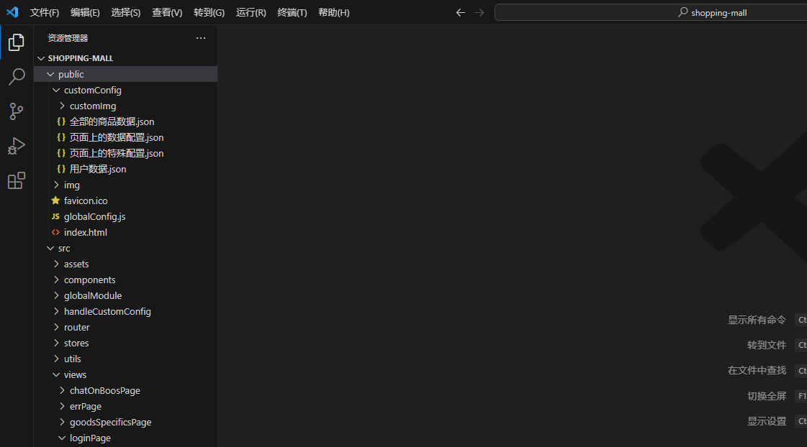

# 纯前端项目

## 使用方法
- **配置文件所在地 `shopping-mall\public\customConfig`，配置方法：[公共部分必看](/docs/public-project.md)**



- **1.打开终端**


- **2.搜先先下载依赖包，输入以下内容,`回车`**
```shell
npm install
```


- **3.等着下载完，输入以下内容，启动服务,可以看到两个链接，浏览器打开那个都可以**
```shell
npm run serve
```


- **4.浏览器打开**


- **5。然后我们就可以看`用户数据.json`**


- **6.登录**


## 注意事项

- **因为是纯前端，所以数据无法做到持久化（`比如无法存到数据库`），网页一刷新，数据就会丢失**

- **然而因为`vue是单页面`，所以页面跳转是不刷新页面的，因此可以使用**

- **所以我们想要跳转页面的时候，需要点击页面里面的**

- **比如，我想回到主页，可以点击`回到首页`**


- **而不要点击这些，这些尽量不要人为干预**

